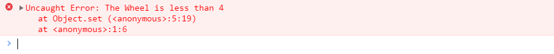

# 解构赋值

解构赋值是对赋值运算的一种扩展，是对数组和对象的一种操作，优点：可以让代码书写更加简洁易懂。在es5中如果需要对对象进行赋值，那么我们需要进行如下的写法操作：

```javascript
let node = {
	type : 'iden',
    name : 'foo'
}
let type = node.iden
let name = node.foo
```

而在es6中可以非常简便的使用解构赋值进行操作：

完全解构

```javascript
let node = {
	type : 'iden',
    name : 'foo'
}
let {type,name} = node
console.log(type,name)
//iden foo
```

不完全解构,可以忽略一些属性

```javascript
let node = {
	type : 'iden',
    name : 'foo'
}
let {name} = node
console.log(name)
//iden foo
```

剩余运算符

```javascript
let obj = {
    a:{
        name : '张三'
    },
    b:[],
    c:'hello world'
}
let {a,...res} = obj
console.log(res)
//res Object
```

数组解构,对数组也可以进行解构

```javascript
let arr = [1,2,3,4]
let [a,b] = arr;
console.log(b)
```


# 对象的扩展功能


可以在es6中创建对象的时候，省下key的值，直接填写value变量。那么对象就会默认人为key为变量名。

```javascript
let name='Jeff',age=20;
let Obj = {
	name,
	age,
	sayName(){
		console.log(this.name)
	}
}
Obj.sayName()
// Jeff
```

可以用这种方式来进行取值器和设置器的编写。

```javascript
let cart = {
    wheel:4,
    set(newVal){
        if(newVal<this.wheel){
            throw new Error('The Wheel is less than 4');
        }
        this.wheel = newVal;
    },
    get(){
        return this.wheel;
    }
}
cart.set(5)
cart.get()
```

运行查看

```javascript
cart.set(3)
```

报错




# 对象等于

```javascript
Object.is(NaN,NaN)
// true
```

# Symbol

原始数据类型Symbol，它表示独一无二的值。

```javascript
const name1 = Symbol('name')
const name2 = Symbol('name')
```

用来定义对象的私有变量。类似。todo

# Set数据类型

```
let set = new Set()
```

添加元素

```
set.add(2)
set.add('5')
set.add([1,2,3,4])
```

删除元素

```
set.delete(2)// 删除第二个元素
```

校验某个值是否存在于集合中

```
set.has('5')
```

遍历set

```
set.forEach((val,key)=>{
	console.log(val,key)
})
```

set 转换成数组

```javascript
let arr = [...set]
```

# Map数据类型

Map类型是键值对的有序列表，键和值是任意类型。

```javascript
let map = new Map()
let map2 = new Map([
	['a',1],
	['c',2]
])


```

设置值

```javascript
// 设置值
map.set('name','张三')
map.set('age',20)
```

取值

```javascript
// 取值
map.get('name')
```

判断是否存在

```javascript
// 判断是否存在
map.has(KeyName)
```
删除
```javascript
map.delete(Name)
```

# 数组扩展高级用法

## 创建数组(Array.of)

在ES6中创建数组的方式出现了新的方式。`Array.of`这个方法用于将一组值转化为数组。

```javascript
Array.of(1,2,3,4,5,6)
// object
Array.of(1,2,3,4,5,{id:1,name:"Jeff"})
```

这个方法的主要目的, 是弥补数组构造函数 `Array()` 的不足. 因为参数个数的不同, 会导致`Array()` 的行为有差异.

```javascript
console.log(Array()); // []
console.log(Array(2)); // [ <2 empty items> ]
console.log(Array(3, 6, 9)); // [ 3, 6, 9 ]
```

上面代码中, `Array` 方法 `没有参数`, `一个参数`, `三个参数` 时, 返回结果都不一样. 只有当参数不少于 2 个时, `Array()` 才会返回由参数组成的新数组. 参数个数只有一个时, 实际上是制定数组的长度.**`Array.of`基本上可以用来替代`Array()`或`new Array()`，并且不存在由于参数不同而导致的重载。它的行为非常统一。**`Array.of`总是返回参数值组成的数组。如果没有参数，就返回一个空数组。

## 转换数组(Array.from)

**`Array.from` 方法用于将两类对象转换为真正的数组:**

1. **类数组对象.**
2. **可遍历对象.**

```javascript
let arrayLike = {
    '0': 'a',
    '1': 'b',
    '2': 'c',
    length: 3
};

// ES5的写法
var arr1 = [].slice.call(arrayLike); // ['a', 'b', 'c']

// ES6的写法
let arr2 = Array.from(arrayLike); // ['a', 'b', 'c']

```

实际应用中, 常见的类数组对象是 DOM 操作返回的 NodeList集合, 以及函数内部的 `arguments` 对象. `Array.from` 都可以将他们转换为真正的数组.

```javascript
// NodeList对象
let ps = document.querySelectorAll('p');
Array.from(ps).filter(p => {
  return p.textContent.length > 100;
});

// arguments对象
function foo() {
  var args = Array.from(arguments);
  // ...
}

```

如果参数是一个真正的数组, 那么`Array.from()` 会返回一个一样的**新数组**

```javascript
Array.from([1, 2, 3])
// [1, 2, 3]
```

## find与findindex

find()方法返回第一个符合条件的数组的元素

数组实例的 find方法, 用于找出第一个符合条件的数组成员 , 它的参数是一个回调函数, 所有数组成员依次执行该回调函数, 直到找出第一个返回值为 true 的成员, 然后返回该成员, 如果没有符合条件的成员, 则返回 undefined。

```javascript
const arr = [1, 3, 5, 7, 9, 2, -4, -6, 8];
const result = arr.find((item, index,arr) => item < 0)
console.log(result); // 返回第一个符合条件的  元素 -4
```

.**这两个方法都可以接收第二个参数, 用来绑定回调函数的 `this`对象**

```javascript
function f(v){
  return v > this.age;
}
let person = {name: 'John', age: 20};
[10, 12, 26, 15].find(f, person);    // 26
```

上面的代码中，find函数接收了第二个参数person对象，回调函数中的this对象指向person对象。

## includes

该方法返回一个布尔值，表示某个数组是否包含给定的值，与字符串的includes方法类似。ES2016 引入了该方法。

```javascript
[1, 2, 3].includes(2)     // true
[1, 2, 3].includes(4)     // false
[1, 2, NaN].includes(NaN) // true
```

该方法的第二个参数表示搜索的起始位置，默认为`0`。如果第二个参数为负数，则表示倒数的位置，如果这时它大于数组长度（比如第二个参数为`-4`，但数组长度为`3`），则会重置为从`0`开始。

```javascript
[1, 2, 3].includes(3, 3);  // false
[1, 2, 3].includes(3, -1); // true
```

## flat和flatMap方法

 **flat**
数组的成员有时还是数组, Array.prototype.flat() 用于将嵌套的数组拉平, 变成一维的数组.

```javascript
const arr = [1,2,[3]]
console.log(arr.flat()); // [1, 2, 3]
```

上面代码中，原数组的成员里面有一个数组，flat()方法将子数组的成员取出来，添加在原来的位置。

flat() 默认只会 “拉平” 一层嵌套数组, 如果想要 “拉平” 多层的嵌套数组, 可以将 flat方法的参数写成一个整数, 表示想要拉平的层数, 默认为 1`

```javascript
const arr = [1, 2, [3, [4, 5]]]
console.log(arr.flat(1)); // [1, 2, 3,[4,5]
console.log(arr.flat(2)); // [1, 2, 3, 4, 5]
```

如果不管数组嵌套多少层, 都要转换为 一维素组, 可以使用Infinity 关键字作为参数.

```javascript
const arr = [1, 2, [3, [4, 5,[6,7,[8,9,[10,11,[12,13]]]]]]]
console.log(arr.flat(Infinity)); // [1, 2, 3, 4, 5, 6, 7, 8, 9, 10, 11, 12, 13]
```

如果原数组有空位, flat() 方法会跳过空位.

```javascript
[1, 2, , 4, 5].flat()
// [1, 2, 4, 5]
```

flatMap() 方法

flatMap() 方法对 原数组的每个成员执行一个函数(相当于执行Array.prototype.map() ), 然后对返回值组成的 新数组执行 `flat() 方法. 该方法返回一个新数组, 不改变原数组.

```javascript
// 相当于 [[2, 4], [3, 6], [4, 8]].flat()
[2, 3, 4].flatMap((x) => [x, x * 2])
// [2, 4, 3, 6, 4, 8]
```

flatMap() 只能展开一层数组。

