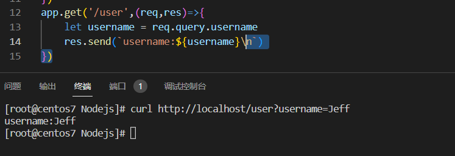
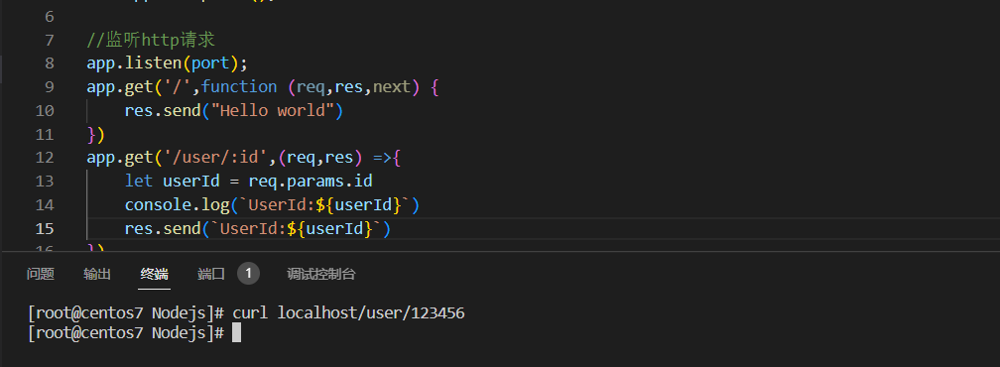

# Express介绍

Express 是一个简洁而灵活的 node.js Web应用框架, 提供了一系列强大特性帮助你创建各种 Web 应用，和丰富的 HTTP 工具。

使用 Express 可以快速地搭建一个完整功能的网站。

Express 框架核心特性：

- 可以设置中间件来响应 HTTP 请求。
- 定义了路由表用于执行不同的 HTTP 请求动作。
- 可以通过向模板传递参数来动态渲染 HTML 页面。

# 快速使用

## 模块安装

```bash
npm install express
```

## 快速创建

```javascript
//应用启动入口
const express = require('express')
const port = 80
//创建app应用 =》NodeJS Http.createServer();
let app = express();

//监听http请求
app.listen(port);
app.get('/',function (req,res,next) {
    res.send("Hello world")
})
```

查看应用


已经部署成功


# Express HTTP请求

## 监听Get请求

通过get方法直接监听get请求

```javascript
//监听http请求
app.listen(port);
app.get('/',function (req,res,next) {
    res.send("Hello world")
})
```

## 监听Post请求

通过post方法直接监听post请求

```javascript
app.post('/user',(req,res)=>{
    res.send('Post Success')
})
```

## 请求参数

### get请求

通过req.query获取到客户端的查询

```javascript
app.post('/user',(req,res)=>{
	let username = req.query.username
    res.send('Post Success')
})
```

请求参数

```
Get http://localhost/user?username=Jeff
```

查看结果



### Post请求

通过req.bodyt获取到post请求中的参数

```javascript
app.post('/user',(req,res)=>{
	let username = req.body.username
    // res.send(`username:${username}\n`)
})
```

可以成功

### Params参数

路由参数，该属性是一个包含映射到[命名路由“参数”](https://expressjs.com/en/guide/routing.html#route-parameters)的属性的对象。例如， route `/user/:name`，则“name”属性可用作`req.params.name`. 此对象默认为`{}`.通过这种方式可以获取到URL中的动态参数.

```javascript
app.get('/user/:id',(req,res) =>{
	let userId = req.params.id
	console.log(`UserId:${userId}`)
})
```

查看结果




# 静态资源

express 提供了一个非常好用的函数，叫做exoress.static(),通过它，可以非常方便的创建静态资源，例如图片、css文件、Javascript文件对外访问

```
app.use(express.static('public'))
```

查看

<span></span>


## 托管多个静态资源目录

多次调用express.static()函数即可。

```
app.use(express.static('public'))
app.use(express.static('files'))
```

访问静态资源的时候，express.static()函数会按照目录的添加顺序，查找所需的文件。例如，index.html分别在这两个文件夹中，那么查询的时候会从上往下顺序查找，查找到文件之后直接返回。

## 挂载路径前缀

如果希望在托管的静态资源访问路径之前，挂载路径前缀，则可以通过如下方式。

```
app.use('/public',express.static('public'))
```

这样子，访问pubic里面的1.png则是通过这个路径

```
localhost/public/1.png
```

# 路由

## Nodejs路由

在Express中，路由指的就是客户端的请求和服务器处理函数之间的映射关系。Express中的路由由三部分组成，分别是:

- 请求的类型：HTTP的请求类型，GET、POST等；
- 请求的URI地址
- 处理函数

格式如下

```javascript
app.METHOD(path,HANDLER)//HANDLER 处理函数
```

路由匹配原理


路由匹配注意点：

- 按照定义的先后顺序进行匹配；
- 请求类型和请求URL同时匹配成功，才回去调用对应的处理函数。

简单的使用

````javascript
const express = require('express')
const app = express()

app.get('/',(req,res) => {res.sned('Hello World')})
app.post('/',(req,res) =>{ res.send('Post Request')})

app.listen(80,() =>{
	console.log('server running at http://127.0.0.1')
})
````


## 路由的模块化

为了方便对路由进行模块化管理，Express不建议将路由直接挂载到app上，而是推荐将路由抽离成单独的模块。

# 中间件

