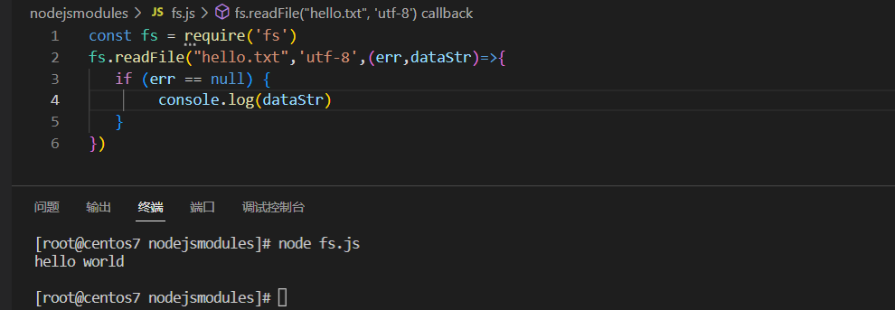
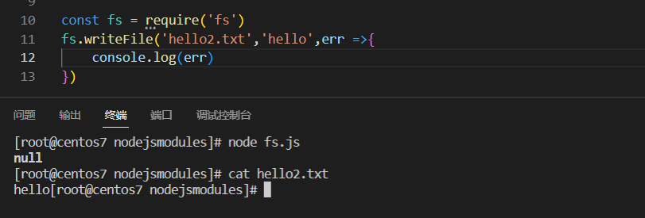
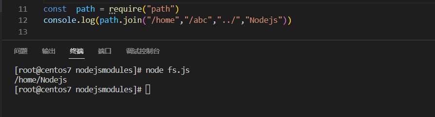
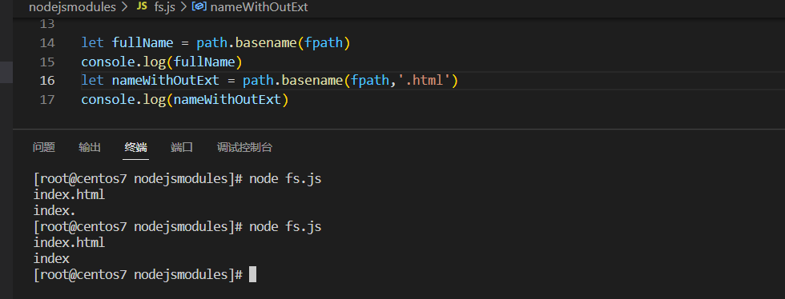

# fs文件系统模块

`fs` 模块提供了许多非常实用的函数来访问文件系统并与文件系统进行交互。无需安装。 作为 Node.js 核心的组成部分，可以通过简单地引用来使用它：

```javascript
const fs = require('fs')
```

## `fs.readFile`

使用`fs.readFile()`方法，可以读取指定文件中的内容，语法格式如下所示：

```
fs.readFile(path[,option],callback)
```

例子

```javascript
const fs = require('fs')
fs.readFile("hello.txt",'utf-8',(err,dataStr)=>{
   if (!err) {
        console.log(dataStr)
   }    
})
```

显示结果




## `fs.writeFile`

使用这个方法，可以像指定文件写入内容，语法格式如下.

```
fs.writeFile(file,data[,options],callback)
```

样例

```javascript
const fs = require('fs')
fs.writeFile('hello2.txt','hello',err =>{
    console.log(err)
})
```

直接结果



可以看出已经成功


## 路径动态拼接

在使用fs模块操作文件时，如果提供的操作路径是以./或者../这种相对路径时，很容易会出现路径动态拼接失败的问题。

原因：在代码运行的过程中，会以执行node命令所在的目录，动态拼接除操作文件的完整路径。

解决方案：使用fs模块操作命令的时候，提供完整的路径不要提供不完整的路径。使用nodejs全局变量来拼接出所需要的完整文件路径.

```javascript
const fs = require('fs')
fs.readFile(__dirname+"hello.txt",'utf-8',(err,dataStr)=>{
    console.log(dataStr)
})
```

# path模块

Node.js path 模块提供了一些用于处理文件路径的小工具，我们可以通过以下方式引入该模块：

```javascript
const  path = require("path")
```

## `path.join`

使用 path.join方法，可以将多个路径片段拼接为一个完整的路径字符

````javascript
path.join([...paths])
````

实例代码

```javascript
const  path = require("path")
const filePath = path.join("/root/","Nodejs","nodejsmodules")
console.log(filePath)
```

结果如下图所示，可以看出使用了path模块就不用关心路径的边界`/`问题了.


PS:注意 '../'会抵消一层路径.




可以利用`__dirname`与`join`方式拼接出当前代码执行路径

```javascript
const  path = require("path")
const fs = require('fs')
fs.readFile(path.join(__dirname,'hello2.txt'),'utf-8',(err,dataStr)=>{
    console.log(dataStr)
})
```

## `path.basename`

使用path.basename方法，可以从一个文件路径中，获取到文件的的名称部分。

```javascript
const fpath = "/a/b/c/index.html"

let fullName = path.basename(fpath)
console.log(fullName)
let nameWithOutExt = path.basename(fpath,'.html')
console.log(nameWithOutExt)
```

运行结果




## path.extname

获取路径中的文件扩展名部分

```javascript
const fpath = "/a/b/c/index.html"
const path = require("path")
let ext = path.extname(fpath)
console.log(ext) // .html
```

