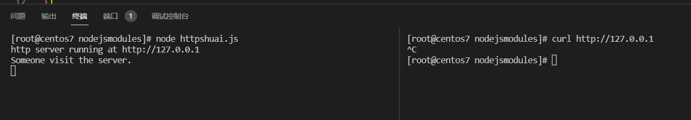
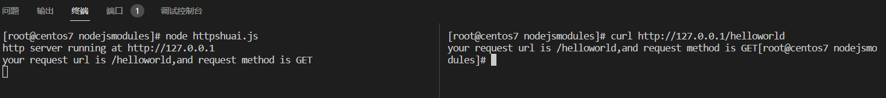

# HTTP模块

HTTP 核心模块是 Node.js 网络的关键模块。主要的应用是两部分:

- http.createServer 担当web服务器
- http.createClient，担当客户端，实现爬虫之类的工作。

## 创建一个http服务器

```javascript
//导入模块
const http = require('http')
//创建服务器对象
const server = http.createServer()
//绑定request请求
server.on('request',(req,res) =>{
    console.log('Someone visit the server.')
})
//启动服务器
server.listen(80,()=>{
    console.log('http server running at http://127.0.0.1')
})
```

查看结果，在右侧终端访问对应的地址，服务器已经产生了获取到请求的日志信息.




## req请求对象

只要服务器接收到了客户端的请求，就会调用server.on()为服务器绑定的request事件处理函数。如果想要在事件处理函数中，访问与客户端相关的数据或者属性，可以用如下方法：

```javascript
server.on('request',(req)=>{
	//req 是请求对象，他包含了与客户端相关的数据和属性；
	//req.url 是客户端请求的url地址
	//req.method 是客户端的method请求类型
})
```

## res 响应对象

在服务器的request事件处理函数中，如果想要访问和服务器相关的数据和属性，可以使用如下方式。

```javascript
server.on('request',(req,res)=>{
	//res 是响应对象，它包含了与服务器相关的数据与属性
	// 要发送到客户端的字符串
	const str = `your request url is ${req.url},and request method is ${req.method}`
	//向客户端发送指定的内容，并且结束这次请求的处理过程
    console.log(str)
	res.end(str)
})
```

结果如下图所示




## 解决乱码问题

设置相应头的编码问题即可。

```javascript
server.on('request',(req,res)=>{
	//res 是响应对象，它包含了与服务器相关的数据与属性
	// 要发送到客户端的字符串
	const str = `your request url is ${req.url},and request method is ${req.method}`
	//向客户端发送指定的内容，并且结束这次请求的处理过程
    console.log(str)
    res.setHeader('Content-Type','text/html;charset=utf-8')
	res.end(str)
})
```

## 路由

根据不同的URI地址返回不同的内容，而这个也就是HTTP服务器的路由。根据`req.url` 判断对应是属于哪一个路由。按照对应的返回回去对应的HTML即可。