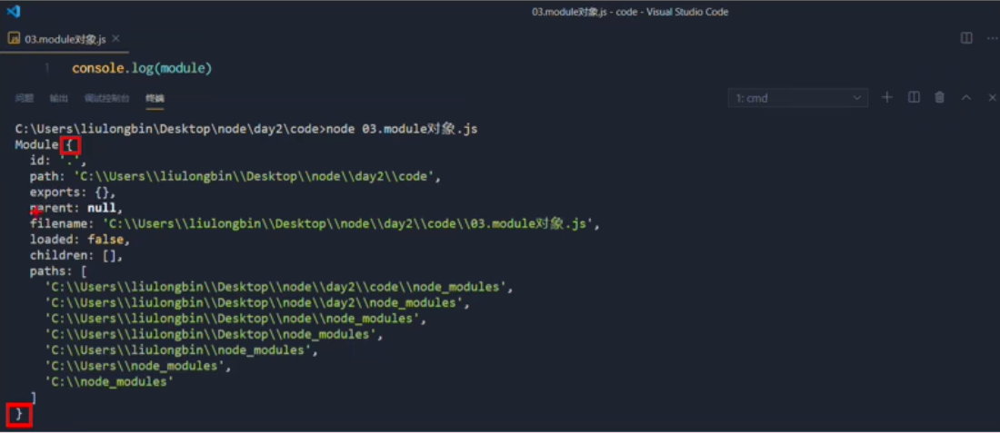
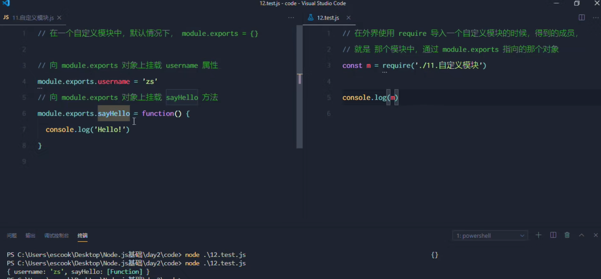
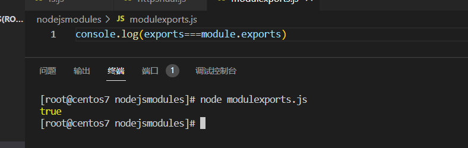
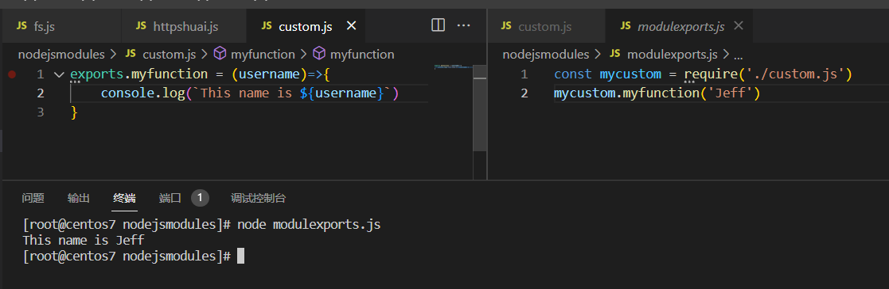

# Node.js 中模块的分类

Node.js 中根据模块的来源不同，可以将模块分为3大类，分别是：

+ 内置模块（内置模块是由Node.js官方提供的，例如fs,http等）
+ 自定义模块（由用户创建的每个.js文件，都是自定义模块）
+ 第三方模块（由第三方开发出来的模块，并非官方提供的内置模块，也不是由用户创建的自定义模块，使用前需要先下载）

## 加载模块

使用require方法，加载模块

```
//加载内置模块
const fs = require('fs')
//加载用户自定义模块
const custom = require('./custom.js')
//加载第三方模块
const moment = require('moment')
```

## 第三方模块的加载与使用

todo

## 模块作用域

防止全局变量污染的问题

## 向外共享模块作用域中的成员

### `module.exports`

每个自定义模块中都有一个module对象，它里面存储了当前模块相关的信息。



这里就是通过exports属性进行暴露成员。即在自定义模块中，可以使用module.exports对象，将模块内的成员共享出去，供外界使用。外界用require()方法导入自定义模块时，得到的就是module.exports中所指的对象。即通过module.exports挂载对象和属性即可。



向外共享成员时候的注意点：

使用require()方法导入模块时，导入的结果以module.exports所指向的对象为准。即在自定义模块中的module.exports可以被覆盖。因此永远以最新的为准。

### `exports`对象

由于module.exports单词写起来比较复杂，为了简化想外共享成员的代码，Node提供了exports对象。默认下，exports和module.exports指向同一个对象，最终共享的结果，还是以module.exports指向的对象为准。

```javascript
console.log(exports===module.exports)
```

结果显示，为true。




### 调用模块内的对象

```javascript
const mycustom = require('./custom.js')
mycustom.myfunction('Jeff')
```

调用这个模块的内容，显示出来的结果。




# CommonJS模块化规范

Node.js 遵循了CommonJS模块化规范，CommonJS规定了模块的特性与各模块之间相互依赖。CommonJS对于模块化有如下规定。

+ 每个模块内部，module变量代表当前模块。
+ module变量是一个对象，它的exports属性（即module.exports）是对外的接口。
+ 加载某个模块，其实就是加载该模块的module.exports属性，用require进行加载模块。
