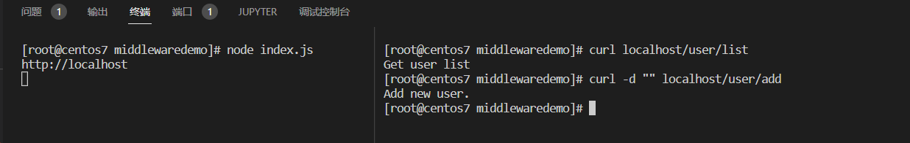

# Express 路由

## 模块化路由

未来方便对路由进行模块化管理，Express不建议将路由直接挂载到app上面，而是推荐将路由抽离为单独的模块。在项目开发过程中，需要把项目根据相关的功能划分为对应的模块，通过模块的划分可以更好的组织项目的目录结构，使项目的整个框架更加清晰。使用方式：

- 创建路由模块对应的js文件
  - 调用express.Router()函数创建路由对象
  - 向路由对象上挂载具体的路由
  - 使用module.exports向外共享路由对象
- 使用app.use()函数注册路由模块

代码示例：

router.js代码

````javascript
// 导入express
const express = require('express')
//创建路由对象
const router = express.Router()
//挂在具体的路由
router.get('/user/list',(req,res)=>{
    res.send('Get user list\n')
})
router.post('/user/add',(req,res) =>{
    res.send('Add new user.\n')
})
// 向外导出路由对象
module.exports = router
````

主文件代码

```javascript
const express = require('express')
const app = express()

// 注册路由模块
const router = require('./router')
app.use(router)

app.listen(80,() => {
    console.log('http://localhost')
})
```

运行结果	



可以看到结果是访问成功的。

样例代码：https://github.com/jsabook/NodejsCode/tree/main/middlewaredemo

当然还可以为路由添加前缀即可

```javascript
app.use('/api',router)
```

如果注册成了这个接口，那么访问/user/add则需要访问这个网址localhost/api/user/add

