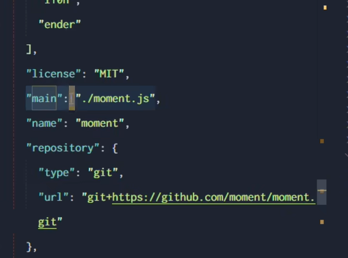

# npm和包

Node.js中第三方模块又叫做包。

## 如何下载包

使用Node Package Manage（npm）来管理包，可以通过npm来从官网将所需要的包下载到本地进行管理使用。

```
npm -v
```

通过这个命令来判断npm是否安装成功，以及安装的是什么版本的。

下载包

```
npm install <package name>
```

通过这个命令来下载包，包下载完成之后即可在代码中使用。同时安装依赖到项目目录 中`mode_modules` 目录下,不写入节点, `npm install` 时不下载该依赖。

```
npm install <package name> -g
```

全局安装,不在 `mode_modules` 目录下,不写入节点, `npm install` 时不下载该依赖.


```
npm install <package name> --save
```

安装依赖到到项目目录的 `mode_modules` 目录下,写入`dependencies`节点, `npm install` 时下载该依赖,一般安装生成环境所用依赖, 如 `vue, element-ui, echarts`…

参考文档：https://blog.csdn.net/u013017173/article/details/108725062


```bash
npm install <module>@<version> //npm install moment@2.22.2
```

值得注意的是：只有工具性质的包才有全局安装的必要性，因为他们提供了好用的终端命令。一般提供终端工具才会全局安装。

## npm使用的注意点

初次安装包完成之后，在项目文件夹中会多出另一个node_modules文件夹和package-lock.json的配置文件，其中：

+ node_modules文件夹用来存放所有以及安装到项目的包，require()导入第三方包的时候，就是从这个目录中找到对应的包并且加载。
+ package-lock.json 配置文件用来记录node_modules目录下每一个包的信息

## 包版本号规范

包的版本号是以点分十进制的形式进行定义，总共三位数字，例如：2.23.1,每一位数字的含义：

+ 第一位数字：大版本号；

+ 第二位数字：功能版本，更新了包的功能；

+ 第三位数字：Bug修复版本


同时需要注意的就是，只要前面的版本号增长了，后面的版本号自动归零。


## 包管理配置文件

npm规定，在项目根目录，需要提供一个	package.json的包管理配置文件，用来记录和项目有关的一些配置信息。

+ 项目的名称、版本号和描述等；
+ 项目中都用到了哪些包；
+ 那些包在开发和部署的时候都需要用到；

### 创建package.json文件

```bas
npm init -y
```


之后运行npm install 安装包的时候，npm包管理工具就会自动把包的名称和版本号自动存入该文件。

## 安装项目所依赖的包

因为项目根目录存在package.json文件，因此只要在项目根目录执行.

```
npm install 
```

就会自动根据package.json自动安装项目所需要的包。

## 卸载包

```
npm uninstall <package name>
```

执行该命令成功之后，会自动将package从package.json中移除掉。


## 切换npm下载源

```bash
#查看当前包的镜像源
npm config get registry
#切换镜像源
npm config set registry= <package image url>
#查看当前包的镜像源
npm config get registry
```

**nrm**

下载nrm

```
npm install nrm -g
```


通过nrm 可以很方便的管理镜像源

```bash
# 查看当前镜像源
nrm ls
# 切换当前镜像源
nrm use taobao
```

## 规范的包结构


一个规范的包，他的组成结构，要求符合下面三点要求：

+ 包必须以单独的目录而存在；
+ 包的顶级目录下必须包含package.json这个包管理配置文件
+ package.json中必须包含name,version,main这三个属性
  + name,包的名字；
  + version，包的版本号；
  + main，包的入口；

main入口，如下图所示。




# 发布包

