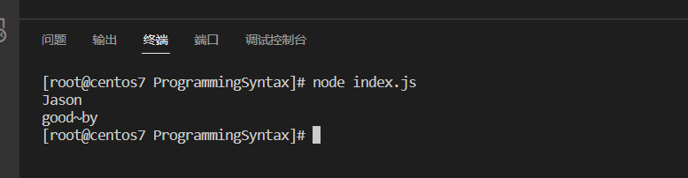
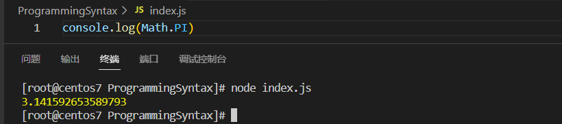

# 对象

对象，是Nodejs中的一种数据结构。是一种无序的数据集合。相当于Java中的类，因此肯定有属性与方法。

# 对象定义

```javascript
let Obj = {
    属性:"属性值",
    方法: 函数(匿名函数)
}
```

访问属性，这里有两种方式

```javascript
let person = {
	name : "jeff",
	age	 : 18,
	sex	 : "man"
}
//第一种访问方式
console.log(person.name)
//第二种方式
console.log(person['age'])
```

输出


# 对象方法定义

```javascript
let person = {
	name  : "Jeff",
	sayHi : function(){
		console.log("hi~~")
	} 
}
//调用对象方法
person.sayHi()
```

# 对象操作与遍历

## 对象操作

创建对象

```
    let person = {
        name  : "Jeff",
        sayHi : function(){
            console.log("hi~~")
        } 
    }
```

### 增

```javascript
person.age = "18" //对象名.新属性名 = 新属性值
```

### 删

```javascript
delete person.age
```

### 改

```javascript
person.name = "Jason"
person.sayHi = function(){
		console.log("good~by")
} 
```

显示结果



### 查

```javascript
console.log(person.name)
person.sayHi()
```

## 遍历对象

使用`let in`

```javascript
for (key key in obj) {
	console.log(key,obj[key])
}
```

# 内置对象

## Math

属性

```
console.log(Math.PI)
```

结果



方法

```
console.log(Math.random())// 返回0到1之间的随机数
```


