# 数据类型

Nodejs是弱数据类型，即变量属于哪种类型，必须赋值之后，才可以确认。

```javascript
let score,names;
score=50;
names='Jarray'
console.log(score,names)
```

显示结果

<span></span>


## **数字**

```bash
浮点数 3.14
整数 1001
科学计数法 123e5
```

数字表达式

```bash
5 + 6
5 * 10
```

## **字符串**

```javascript
let str1 = 'Hello world' //单引号 
let str2 = "hello world" //双引号
let str3 = `hello world` //反引号
```

单引号与双引号无区别，建议使用单引号。同时反引号可以换行

```javascript
let str4 = `hello 
world `//反引号换行
console.log(str4)
```

字符串拼接，可以直接通过加号将两个字符串合并成一个字符串

```javascript
let str1 = 'Hello world' //单引号 
let str2 = "hello world" //双引号
console.log(str1+str2)
```

显示结果

<span>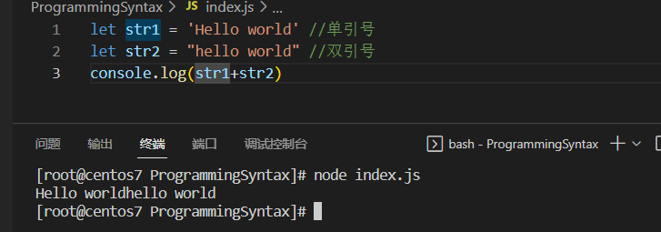</span>

## 字符串属性与方法

### 字符串属性

```javascript
constructor 对创建该对象的函数的引用
length      字符串的长度
prototype   允许您向对象添加属性和方法
```

### 字符串方法

+ concat()      连接两个或更多字符串，并返回新的字符串。
+ charCodeAt()  返回在指定的位置的字符的 Unicode 编码。
+ match()       查找找到一个或多个正则表达式的匹配。
+ replace()     在字符串中查找匹配的子串，并替换与正则表达式匹配的子串。
+ replaceAll()  在字符串中查找匹配的子串，并替换与正则表达式匹配的所有子串。
+ slice()       提取字符串的片断，并在新的字符串中返回被提取的部分。
+ split()       把字符串分割为字符串数组。
+ trim()        去除字符串两边的空白。

## 模板字符串/格式化字符串

作用：拼接字符串和变量；

使用方式:

+ 使用"`"，将字符串包起来；
+ 内容拼接变量时，使用`${}`包住变量

```javascript
let name = "Jeff"
let age = 20
console.log(`${name} is ${age} years old`)
```

结果查看

<span>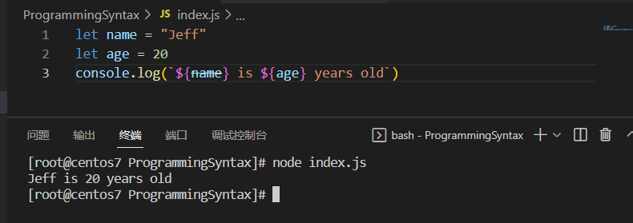</span>

## 布尔

```javascript
let isCool = true;
let isHot = false; 
```

## 未定义

undefined，是比较特殊的值。只有当只申明变量，不复制的情况下，变量默认值为undefined。

### 使用场景

我们在开发中经常申明一个变量，等带传送过来的数据；如果我们不知道这个数据是否传递过来，此时可以检测这个变量是否为undefined，就可以判定数据是否已经传递过来。

## 空类型

null表示值为空；

### null与undefined的区别

+ undefined表示没有赋值；
+ null表示赋值了，但是内容为空；

使用场景

将null作为尚未创建的对象，即未来有变量中存放一个对象，但是对象并没有创建好，可以先设定为null。

## 数据类型检测与转换

### 数据类型检测

数据类型：`number`、`string`、`boolean`、`underfind`、`null`

通过`typeof`关键字检测数据类型，通过typeof返回回来的就是这个数据类型的字符串.

```javascript
let str1 = 'Hello world' //单引号 
console.log(typeof str1=='string')
```

结果如下

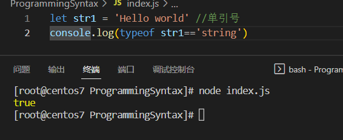

也存在另外一种写法。

```javascript
let str1 = 'Hello world' //单引号 
console.log(typeof(str1))
```

### 数据类型转换

转换分为：

+ 显式转换；
+ 隐式转换；

将数据从一种类型转换为另外一种类型。

**隐式转换**：某些运算符被执行时，系统内部自动将数据类型进行转换。这种转换称为隐式转换。

+ `+`号两边只要有一个是字符串，都会将另外一个转换为字符串；
+ 其他符号，比如`-`,`*`,`/`都会将数据转换成数据类型

加号作为正号解析可以转换为数字

```javascript
console.log(1+ +"1")
```

结果

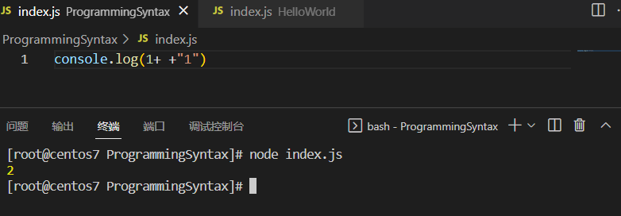

因为转换类型不明确，因此我们一般使用显式转换。

### 显式转换

通过关键字来对数据进行转换

### 转换为数字型

+ Number(数据)
  + 转换为数字类型
  + 如果字符串内容里面有非数字，转换失败结果为NaN(Not a Number)
  + NanN也是number类型的数据，代表非数字；
+ parseInt(数据)
  + 只保留整数，没有四舍五入。
+ parseFloat(证书)
  + 可以保留小数

结果显示

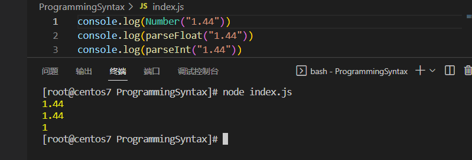

# 运算符

## 算数运算符

| 符号 | 含义                                                 |
| ---- | ---------------------------------------------------- |
| +    | 求和                                                 |
| -    | 求差                                                 |
| *    | 求积                                                 |
| 、   | 求商                                                 |
| %    | 取模（取余数，开发中经常作为某个数字是否能够被整除） |

### 赋值运算符

```javascript
num+=1 ==>num=num+1
num*=1
num-=1
num/=1
num%=1
```

### 一元运算符

```javascript
let num = 1;
++num;
num++;
```

++num和num++的区别  todo

## 比较运算符

比较运算符有如下：

| 符号  | 含义                               |
| ----- | ---------------------------------- |
| `>`   | 大于号                             |
| `<`   | 小于号                             |
| `>=`  | 大于等于                           |
| `<=`  | 小于等于                           |
| `==`  | 等于                               |
| `===` | 左右两边类型和值是否相等，强制等于 |
| `!==` | 左右两边是否不全等                 |

比较结果为Boolean类型。

**`==`与`===`的区别**

```
console.log('10'==10)
console.log('10'===10)
```

结果显示

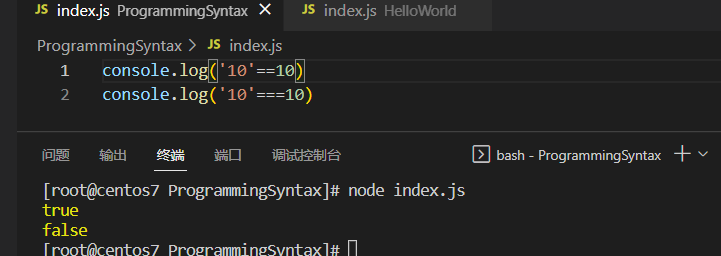

### 字符串比较

按照ASCII码进行比较

+ 从左往右依次比较；
+ 如果第一位一样再比较第二位，以此类推；

PS：

+ NaN不当与任何值，包括它本身；

+ 尽量不要比较小数，因为小数有精度问题；

+ 不同类型直接比较会发送隐式转换

```javascript
console.log(3 > '2') //true
```

## 逻辑运算符

| 符号 | 含义   | 日常 | 特点                         |
| ---- | ------ | ---- | ---------------------------- |
| &&   | 逻辑与 | 并且 | 两边为true，结果为true       |
| \|\| | 逻辑或 | 或者 | 两边有一个为true，结果为true |
| ！   | 逻辑非 | 取反 | true变false，false变true     |

### 逻辑运算短路

短路：只存在于&&与||中，当满足一定的条件让右边的代码不执行，

| 符号 | 短路条件          |
| ---- | ----------------- |
| &&   | 左边为false就短路 |
| \|\| | 左边为true就短路  |

原因：通过左边就能够得到整个式子的结果，因此没有必要再判断右边。距离

```javascript
console.log( undefined || 0 ) //遇到这个，左边为假直接执行右边，最后结果为console.log( 0 ) 
```

运算结果：无论&&还是||，运算结果都是最后被执行的表达式，一般用在变量赋值。有些数据是作为false来使用: `false`、`0`、`''`、`undefined`、`null`。

**`||`短路**

```javascript
console.log(false && 20) // false
console.log(5<4 && 20) // false
console.log(undefined && 20) // undefined 
console.log(null && 20) // null
console.log(0 && 20) // 0 
console.log(10 && 20) // 20
```

**`&&`短路**

```javascript
console.log(false || 20) // 20
console.log(5<4 || 20) // 20
console.log(undefined || 20) // 20 
console.log(null || 20) // 20
console.log(0 || 20) // 20 
console.log(10 || 20) // 10
```

短路应用

```javascript
function func(x,y){
   return  x+y 
}
function func1(x,y){
    x = x || 0
    y = y || 0
    return  x+y 
 }
console.log(func(),func1())
```

结果显示

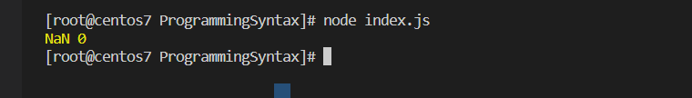

# 数据结构

## 数组

## 数组操作

## 创建数组

```javascript
let arr = ["data1","data2","data3"]
console.log(arr)
// 数组总长度,这个是数组的一个属性
arr.length
```

## 数组增删改查

### **增加数组元素**——`arr.push('新增的内容')`

可以将一个或者多个元素添加到数组的末尾。并返回该数组的新长度

```javascript
let newArrayLen = arr.push(元素1,元素2,...,元素n)
console.log( newArrayLen ) //数组的新长度
```

### 增加数组元素——`arr.unshift('新增的内容')`

将一个或者多个元素添加到数组的开头，并返回数组的新长度

```javascript
let newArrayLen = arr.unshift(元素1,元素2,...,元素n)
console.log( newArrayLen ) //数组的新长度
```

### 删除元素

```javascript
let element = arr.pop()// 从数组中删除最后一个元素，并返回该元素的值
arr.shift()
arr.splice(起始位置，删除几个元素) // 删除多个元素，从起始位置开始，删除几个元素
```

### 改变元素

```javascript
arr[0] = "Data1"
```

### 获取元素

```javascript
arr[0]
```

### 访问数组

```javascript
let arr = ["data1","data2","data3"]
let data1 = arr[0]
```

数组可以由不同对象组成

```javascript
arr[1] = Date.now;
arr[2] = myFunction;
arr[3] = "mydata"
```

## **数组对象方法**

### 属性

```javascript
arr.length  设置或返回数组元素的个数。
```

### 方法

连接数组

```javascript
//连接两个数组
let hege = ["Cecilie", "Lone"];
let stale = ["Emil", "Tobias", "Linus"];
let children = hege.concat(stale);
console.log(children)
//连接三个数组
var parents = ["Jani", "Tove"];
var brothers = ["Stale", "Kai Jim", "Borge"];
var children = ["Cecilie", "Lone"];
var family = parents.concat(brothers, children);
```

可迭代对象——todo

检测数组元素是否都是符合要求--`Array.every()`

```javascript
var ages = [32, 33, 16, 40];

function checkAdult(age) {
    return age >= 18;
}
console.log(ages.every(checkAdult))
```

输出结果

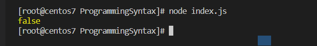

返回数组符合要求的子数组(`Array.filter()`)

```javascript
var ages = [32, 33, 16, 40];

function checkAdult(age) {
    return age >= 18;
}

console.log(ages.filter(checkAdult))
```

输出结果

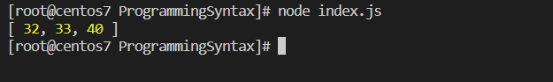

todo


# 字面量、常量、变量

命名规则

+ 不能使用关键字；
+ 只能使用下划线、字母、数字与$。且数字不能开头
+ 字母严格区分大小写，如Age和age是不同的变量

命名规范

+ 起名要有意义
+ 遵循小驼峰命名法
  + 第一个单词首字母小写，后面每个单词首字母大写；

## 常量

## 变量

在编程语言中，变量用于存储数据值。Nodejs 使用关键字 **var** 和**let**来定义变量，

```javascript
let age = "18 years"
let age2
age2 = "20 years"
console.log(age,age2)
var age3 = "21 years" 
console.log(age3)
```

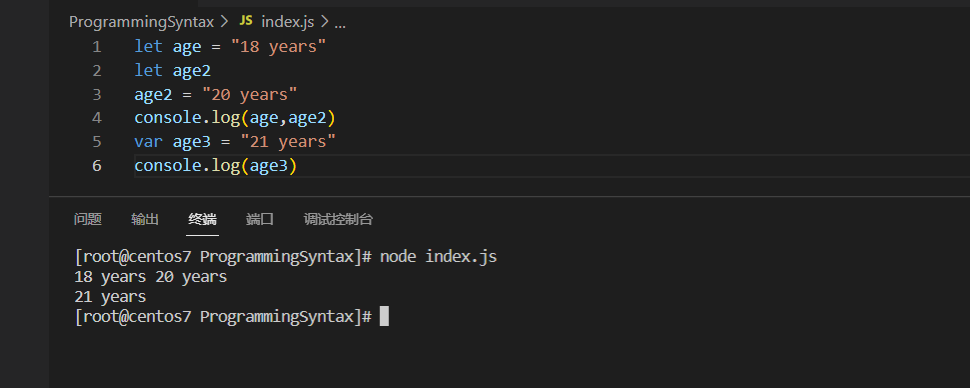

## var、let 和 const 辨析

ES2015（ES6）推出了许多闪亮的新功能。从 2020 年开始，我们假设许多 JavaScript 开发人员已经熟悉并开始使用这些功能。

尽管这个假设可能部分正确，但是其中某些功能可能对一些开发人员来说仍然是个谜。

ES6 附带的功能之一是添加了`let`和`const`，可用于变量声明。问题是，它们与`var`有何不同？ 下面将会辨析这三者的区别。

## var

在 ES6 出现之前，必须使用 `var` 声明。但是，前端开发出现的一些问题与使用 `var` 声明的变量有关。这就是为什么必须要有新的方法来声明变量。首先，让我们在讨论这些问题之前更多地了解 `var`。

### var 的作用域

**作用域**本质上是指变量/函数可供访问的范围。`var`可以在全局范围声明或函数/局部范围内声明。

当在最外层函数的外部声明`var`变量时，作用域是全局的。这意味着在最外层函数的外部用`var`声明的任何变量都可以在`windows`中使用。

当在函数中声明`var`时，作用域是局部的。这意味着它只能在函数内访问。

要进一步了解，请查看下面的示例。

```javascript
var greeter = 'hey hi';

function newFunction() {
    var hello = 'hello';
}
```

这里，`greeter`是全局范围的，因为它存在于函数外部，而`hello`是函数范围的。因此，我们无法在函数外部访问变量`hello`。因此，如果我们这样做：

```javascript
var tester = 'hey hi';
function newFunction() {
    var hello = 'hello';
}
console.log(hello); // error: hello is not defined
```

我们会收到错误消息，这是由于函数外部没有`hello`导致的。

### var 变量可以重新声明和修改

这意味着我们可以在相同的作用域内执行下面的操作，并且不会出错

```javascript
var greeter = 'hey hi';
var greeter = 'say Hello instead';
```

又比如

```javascript
var greeter = 'hey hi';
greeter = 'say Hello instead';
```

### var 的变量提升

变量提升是 JavaScript 的一种机制:在执行代码之前，变量和函数声明会移至其作用域的顶部。这意味着如果我们这样做:

```javascript
console.log(greeter);
var greeter = 'say hello';
```

生面的代码会被解释为:

```javascript
var greeter;
console.log(greeter); // greeter is undefined
greeter = 'say hello';
```

因此，将`var`声明的变量会被提升到其作用域的顶部，并使用 undefined 值对其进行初始化.

### var 的问题

`var`有一个弱点。我将使用以下示例进行说明：

```javascript
var greeter = "hey hi";
var times = 4;
if (times &gt; 3) {
    var greeter = "say Hello instead";
}

console.log(greeter) // "say Hello instead"
```

由于`times> 3`返回 true，因此将`greeter`重新定义为`saysay Hello`。如果你有是故意重新定义`greeter`，这段代码是问题的，但是当你不知道之前已经定义了变量`greeter`时，这将成为产生问题。

如果在代码的其他部分使用了`greeter`，这可能会导致代码中出现许多错误。这就是为什么需要`let`和`const`的原因。

## let

`let`现在已经成为变量声明的首选。这并不奇怪，因为它是对`var`声明的改进。它也解决了我们刚刚介绍的`var`问题。让我们考虑一下为什么会这样。

### let 是块级作用域

块是由 {} 界定的代码块，大括号中有一个块。大括号内的任何内容都包含在一个块级作用域中.

因此，在带有`let`的块中声明的变量仅可在该块中使用。让我用一个例子解释一下

```javascript
let greeting = 'say Hi';
let times = 4;

if (times > 3) {
    let hello = 'say Hello instead';
    console.log(hello); // "say Hello instead"
}
console.log(hello); // hello is not defined
```

我们看到在其代码块（定义它的花括号）之外使用`hello`会返回错误。这是因为`let`变量是块范围的.

### let 可以被修改但是不能被重新声明.

就像`var`一样，用`let`声明的变量可以在其范围内被修改。但与`var`不同的是，`let`变量无法在其作用域内被重新声明。 来看下面的栗子:

```javascript
let greeting = 'say Hi';
greeting = 'say Hello instead';
```

上面的代码将会返回一个错误:

```javascript
let greeting = 'say Hi';
let greeting = 'say Hello instead'; // error: Identifier 'greeting' has already been declared
```

但是，如果在不同的作用域中定义了相同的变量，则不会有错误：

```javascript
let greeting = 'say Hi';
if (true) {
    let greeting = 'say Hello instead';
    console.log(greeting); // "say Hello instead"
}
console.log(greeting); // "say Hi"
```

为什么没有错误？ 这是因为两个实例的作用域不同，因此它们会被视为不同的变量。

这个事实说明:使用`let`,是比`var`更好的选择。当使用`let`时，你不必费心思考 🤔 变量的名称，因为变量仅在其块级作用域内存在。

同样，由于在一个块级作用域内不能多次声明一个变量，因此不会发生前面讨论的`var`出现的问题。

### let 的变量提升

就像`var`一样，`let`声明也被提升到作用域顶部。
但不同的是:

+ 用`var`声明的变量会被提升到其作用域的顶部，并使用 undefined 值对其进行初始化。
+ 用`let`声明的变量会被提升到其作用域的顶部，不会对值进行初始化。

因此，如果你尝试在声明前使用`let`变量，则会收到`Reference Error`。

## Const

用`const`声明的变量保持常量值。 `const`声明与`let`声明有一些相似之处

### const 声明的变量在块级作用域内

像`let`声明一样，`const`声明只能在声明它们的块级作用域中访问

### const 不能被修改并且不能被重新声明

这意味着用`const`声明的变量的值保持不变。不能修改或重新声明。因此，如果我们使用`const`声明变量，那么我们将无法做到这一点:

```javascript
const greeting = 'say Hi';
greeting = 'say Hello instead'; // error: Assignment to constant variable.
```

或者这个这样:

```javascript
const greeting = 'say Hi';
const greeting = 'say Hello instead'; // error: Identifier 'greeting' has already been declared
```

因此，每个`const`声明都必须在声明时进行初始化。

当用`const`声明对象时，这种行为却有所不同。虽然不能更新`const`对象，但是可以更新该对象的属性。 因此，如果我们声明一个`const`对象为

```javascript
const greeting = {
    message: 'say Hi',
    times: 4,
};
```

同样不能像下面这样做:

```javascript
const greeting = {
    words: 'Hello',
    number: 'five',
}; // error:  Assignment to constant variable.
```

但我们可以这样做:

```javascript
greeting.message = 'say Hello instead';
```

这将更新`greeting.message`的值，而不会返回错误。

### const 的变量提升

就像`let`一样，`const`声明也被提升到顶部，但是没有初始化。

最后，我们总结一下它们的异同：

+ `var`声明是全局作用域或函数作用域，而`let`和`const`是块作用域。
+ `var`变量可以在其范围内更新和重新声明； `let`变量可以被更新但不能重新声明； `const`变量既不能更新也不能重新声明。
+ 它们都被提升到其作用域的顶端。但是，虽然使用变量`undefined`初始化了`var`变量，但未初始化`let`和`const`变量。
+ 尽管可以在不初始化的情况下声明`var`和`let`，但是在声明期间必须初始化`const`。

## 总结

| 含义   | var  | let  | const |
| ---- | ---- | ---- | ----- |
| 作用域 | 全局 | 块（一个花括号内） | 块（一个花括号内） |
| 重定义与可修改 | 重定义与可修改 | 不可重定义但可修改 | 不可重定义不可修改 |
| 变量提升 | 用`var`声明的变量会被提升到其作用域的顶部，并使用 undefined 值对其进行初始化。（先使用。再申明） | 用`let`声明的变量会被提升到其作用域的顶部，不会对值进行初始化。 | 声明期间必须初始化`const`。 |

# 基本语句

## 表达式与语句

**表达式**：是一组代码的集合，Nodejs会将其计算出一个结果；

**语句**：整句或者命令。Nodejs语句是以分号结束（可以省掉）；

**区别**：表达式计算出一个值，但是语句用来自行以使某件事情发生。

**程序中常见的语句：**顺序结构、分支结构、循环结构

## 分支语句

分支语句：if分支语句，三元运算符，switch语句；

### if分支语句

**单分支if语句**

```javascript
if (Boolean) {
  todo
}
```

**双分支语句**

```javascript
if (Boolean) {
	todo
} else {
	todo
}
```

**多分支语句**

```javascript
if (条件1) {
	todo
} else if (条件2) {
	todo 
} else if (条件3) {
	todo
} else {
	todo
}
```

### 三元运算符（三元表达式）

```javascript
condition ? exprIfTrue : exprIfFalse
```

等价于

```javascript
if ( condition ) {
	exprIfTrue
} else {
	exprIfFalse
}
```

作用：一般用来取值

举例

```javascript
console.log(true ? 1 : 2) // 1
console.log(false ? 1 : 2) //2
```

### switch分支

```javascript
switch(expression)
{
    case 1:
        执行代码块 1
        break;
    case 2:
        执行代码块 2
        break;
    default:
        与 case 1 和 case 2 不同时执行的代码
}
```

**PS**注意点:

+ switch case语句一般用作等值判断，不适用于区间判断；
+ switch case一般需要配置break关键字，否则会导致case击穿；

```javascript
let d=new Date().getDay();
let x=null;
switch (d)
{
    case 6:x="今天是星期六";
    break;
    case 0:x="今天是星期日";
    break;
    default:
    x="期待周末";
}
console.log(x)
```

结果显示

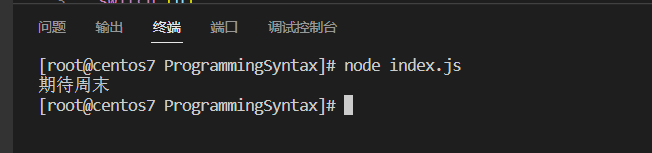

## 循环分支

循环三要素，任何一个循环都需要有这三个要素：

+ 变量起始值；
+ 终止条件；
+ 变量变化量；

循环退出

+ continue:结束本次循环，继续进入下次循环；
+ break：直接跳出循环

### while循环

代码

```javascript
while (循环条件) {
	todo(循环体)
}
```

循环三要素代码

```javascript
let i = 1;
while (i <=3) {
	console.log(i)
	i++
}
```

### for循环

**for 单体**

```javascript
for ([initialization]; [condition]; [final-expression])
   statement
```

举例

```javascript
let str = '';

for (let i = 0; i < 9; i++) {
  str = str + i;
}

console.log(str);
// expected output: "012345678"

```

可以从单体中看到`initialization`、`condition`和`final-expression`都可以省掉。

initialization省掉

```javascript
var i = 0;
for (; i < 9; i++) {
    console.log(i);
    // more statements
}
```

condition省掉

```javascript
for (let i = 0;; i++) {
   console.log(i);
   if (i > 3) break;
   // more statements
}
```

全部省掉

```javascript
var i = 0;

for (;;) {
  if (i > 3) break;
  console.log(i);
  i++;
}

```

**for...in**, 循环遍历对象的属性

```javascript
const object = { a: 1, b: 2, c: 3 };

for (const property in object) {
  console.log(`${property}: ${object[property]}`);
}

// expected output:
// "a: 1"
// "b: 2"
// "c: 3"
```

**for...of**,循环遍历数组内容

```javascript
const array1 = ['a', 'b', 'c'];

for (const element of array1) {
  console.log(element);
}

// expected output: "a"
// expected output: "b"
// expected output: "c"
```

除了遍历const常量，也可以遍历变量数组。

```javascript
let array1 = ['a','b','c','d' ]
for ( let element of array1) {
   console.log(element)
} 
```

