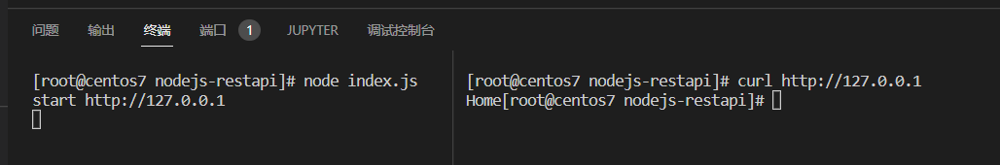

代码位置：https://github.com/jsabook/NodejsCode/tree/main/nodejs-restapi

##  初始化项目

```
npm init -y
npm install express
```

## 创建基本的服务器

我们这边在app.js文件中创建一个基础的服务器

```javascript
const express = require('express')
const app = express()

app.use(express.urlencoded({ extended: false }))
app.use(express.json())

app.get('/',(req,res) => {
    res.send('Home')
})

app.listen(80,() => {
    console.log('start http://127.0.0.1')
})
```

运行结果如下




## 创建API模块

这里使用路由模块化思路创建API模块

```javascript
const express = require('express')
const apiRouter = express.Router()
```


编写GET接口

```javascript
apiRouter.get('/get',(req,res) => {
    const query = req.query
    req.send({
        status: 0,
        msg : "Get 请求成功",
        data : query
    })
})

```

编写POST接口

```
apiRouter.post('/post',(req,res) => {
    const body = req.body
    res.send({
        status: 0,
        msg : "Post 请求成功",
        data : body
    })
})
```

接口对外访问

```
module.exports = apiRouter
```

## 注册API模块

在app.js中将api路由注册到app中。

```javascript
const apiRouter = require('./apiRouter')
app.use('/api',apiRouter)
```

结果测试

