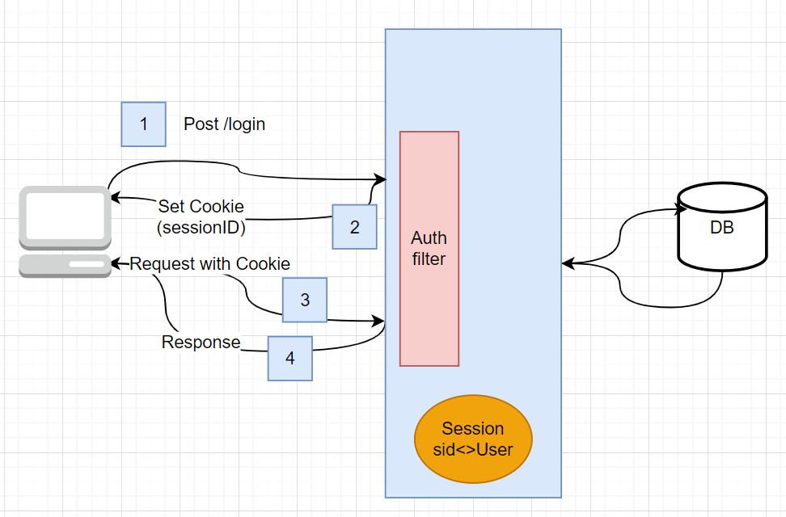
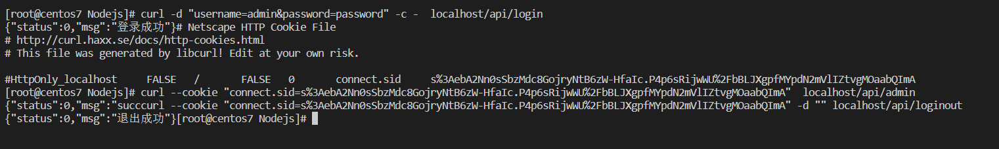
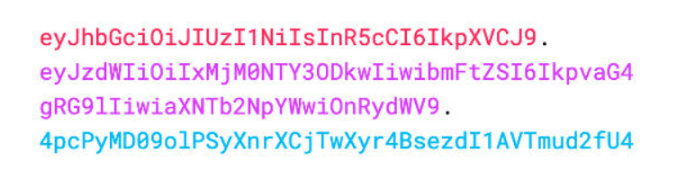
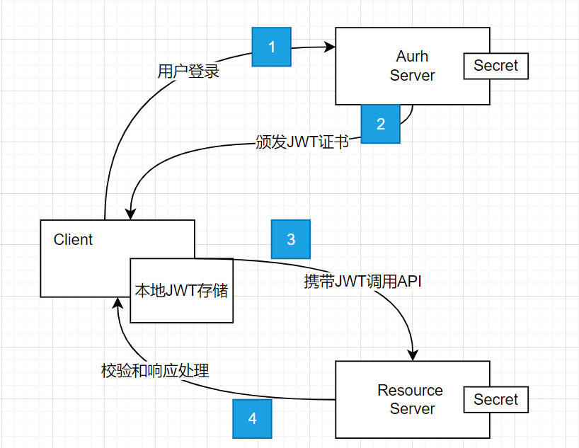
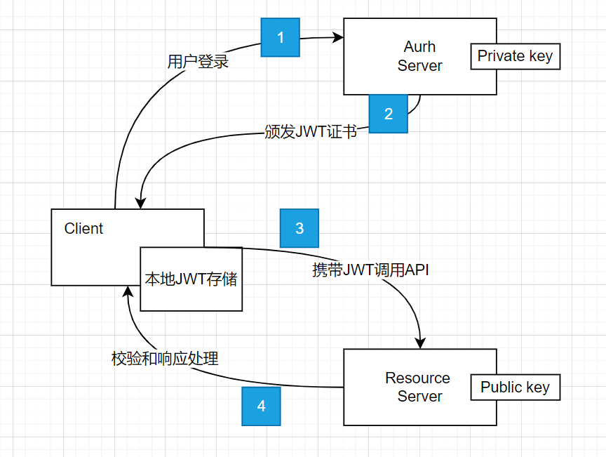
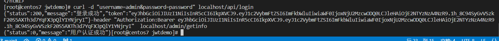

# 身份认证

身份认证又称为身份验证，即通过一定的手段，完成对用户身份的认证。在web开发中为什么需要身份认证。因为HTTP协议是无状态协议，即每个请求之间都是相互独立的，因此我们需要通过某种身份认证的手段来保障web的安全。

## Session认证机制




**Session认证机制**：

- 用户通过浏览器将用户名和密码发送给服务端，服务器会对这个用户名和密码进行校验，如果校验成功（用户名和密码与数据库中的相同），那么服务器就在内存中开辟出一块区域用来创建Session会话，这个Session是hash模式`SessionId:User信息`
- 服务器将SessionId返回给浏览器
- 浏览器接受到Session之后，写入到的存储中
- 客户第二次发起请求的时候，会带上这个Cookie(SessionID)，发送给服务器；
- 服务器接收到这个SessionID之后先去与内存中的SessionID进行匹配，如果能够匹配到，则返回相应信息

**代码实现**

下面代码来实现这个过程，如果session认证成功则返回相应信息。

这里需要用到`express-session`,先进行安装. 

```
npm install express-session
```


值得注意的是，这个express-session也是中间件，也需要进行注册中间件。 

创建服务器

```javascript
const express = require('express')
const session = require('express-session')

const app = express()

app.use(session({
    secret:'Jeff',
    resave: false,
    saveUninitialized: true,
}))


app.listen(80,() => {
    console.log('Start http://localhost/')
})
```

登录路由编写

校验用户名和密码，如果校验失败直接返回error，否则写入到session中。当express-session中间件配置成功之后，即可通过req.session来访问和使用session对象。从而存储关键信息。

```javascript
app.post('/api/login',(req,res) =>{
    if (req.body.username != 'admin' || req.body.password !='password'){
        return res.send({
            status: 1,
            msg : "登陆失败"
        })
    }
    req.session.user = req.body
    req.session.islogin = true

    res.send({
        status:0,
        msg : "登录成功"
    })
})
```

判定是否登录

可以直接从req.session对象中获取之前存储的数据

```javascript
app.get('/api/username',(req,res) => {
	if (!req.session.islogin) {
		return res.send({
			status: 1,
            msg : "fail"
		})
	}
    res.send({
        status:0,
        msg:"success",
        username:req.session.username
    })
})
```

退出登录

```javascript
app.post('/api/loginout',(req,res) =>{
    req.session.destroy()
    res.send({
        status:0,
        msg : "退出成功"
    })
})
```

结果显示




代码文件地址：https://github.com/jsabook/NodejsCode/tree/main/sessiondemo

## JWT认证机制

JSON Web Token（缩写 JWT）。JWT 的原理是，服务器认证以后，生成一个 JSON 对象，发回给用户，就像下面这样。

```javascript
{
  "姓名": "张三",
  "角色": "管理员",
  "到期时间": "2018年7月1日0点0分"
}
```

以后，用户与服务端通信的时候，都要发回这个 JSON 对象。服务器完全只靠这个对象认定用户身份。为了防止用户篡改数据，服务器在生成这个对象的时候，会加上签名（详见后文）。

服务器就不保存任何 session 数据了，也就是说，服务器变成无状态了，从而比较容易实现扩展。

### JWT 的数据结构

实际的 JWT 大概就像下面这样。



它是一个很长的字符串，中间用点（`.`）分隔成三个部分。注意，JWT 内部是没有换行的，这里只是为了便于展示，将它写成了几行。

JWT 的三个部分依次如下。

- Header，{"type":"JWT","alg":"HS256"} 固定

- Payload，存放信息，比如，用户id，过期时间等等，可以被解密，不能存放敏感信息

-  Signature，Header和Payload加上秘钥 加密而成，只要秘钥不丢失，可以认为是安全的。

从上述信息我们就可以了解到JWT验证的本质就是主要就是验证C部分 是否合法。

### JWT 的使用方式

户端收到服务器返回的 JWT，可以储存在 Cookie 里面，也可以储存在 localStorage。

此后，客户端每次与服务器通信，都要带上这个 JWT。你可以把它放在 Cookie 里面自动发送，但是这样不能跨域，所以更好的做法是放在 HTTP 请求的头信息`Authorization`字段里面。

```
Authorization: Bearer <token>	
```

而根据密钥的存储方式不同，我们就可以将其分为两种方式
**HMAC流程认证**



**RSA流程认证**



为了方便起见，后续我们都是用HMAC这种模式。


### 代码编程

安装JWT相关的包

```
npm install jsonwebtoken express-jwt
```

其中：

- jsonwebtoken 用于生成JWT字符串
- express-jwt 用于将JWT字符串解析成为JSON对象

代码中生成服务器

```javascript
const cors = require('cors')
const express = require('express')
const jwt = require('jsonwebtoken')
const expressJWT = require('express-jwt')

const app = express()

app.use(cors())

app.get('/',(req,res) =>{
    res.send('home pages')
})
app.listen(80,() => {
    console.log('Start http://127.0.0.1')
})
```

定义secret密钥

为了保证JWT字符串的安全性，防止JWT字符串在网络传输过程中被别人所破解，因此需要定义一个用于加密解密的secret密钥

- 生成JWT字符串的时候，需要使用secret密钥对用户信息进行加密；
- 当需要验证签名的完整性的时候就需要用到secret对用户的JWT重新签名看看是否被修改。

```
const secretkey = 'Xianju'
```

在登录成功后生成JWT字符串

调用Jsonwebtoken包提供的sign()方法，将用户的信息做加密签名成为token，再将token返回给客户端。

```javascript
app.post('/api/login',(req,res) => {
    if (req.body.username != 'admin' || req.body.password !='password'){
        return res.send({
            status: 1,
            msg : "登陆失败"
        })
    }
    const tokenStr =  jwt.sign({username:req.body.username},secretkey,{expiresIn:"30s"})
    res.send({
        status: 200,
        message: "登录成功",
        token :tokenStr
    })
})
```

鉴权

客户端每次在访问那些由权限接口的时候，都需要主动通过请求头中的Authorization，将token发送到服务器进行身份认证。而这个鉴权的过程是直接通过express-jwt这个中间件完成的。只需要将express-jwt注册到app中即可。

```javascript
app.use(expressJwt({secret:secretkey,algorithms: ["HS256"]}).unless({path:[/^\/api\//]}))
```

然后就可以之前用req.user进行调用，因为鉴权已经在前面一个步骤做掉了。只要配置了中间件，就可以将jwt中前面两部分解析出来挂载到req.user中。 	

```

app.get('/admin/getinfo',(req,res) =>{
    res.send({
        status:0,
        message:"用户认证成功",
        data :req.user
    })
})
```

结果显示




### 捕获JWT失败后产生的错误

```javascript
app.use((err,req,res,next) => {
    if(err.name ==='UnauthorizedError'){
        return res.send({
            status:401,
            message: "无效的token"
        })
    } 
    res.send({
        status:500,
        message:"未知错误"
    })
})
```

