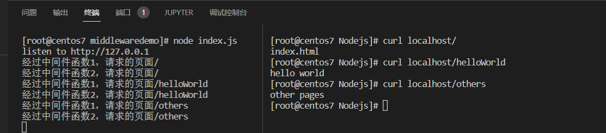

除了错误级别的中间件，其他的中间件，必须在路由之前进行配置。


# 中间件

中间件是一种实现模式或概念。但是到达映射函数之前，会经过很多个中间件函数。我们通过中间件函数可以实现很多功能：

- 共享同一份req和res。基于这样的特性，我们可以在上游的中间件中，统一为req或者res添加自定义的属性与方法，供下游的中间件或者路由进行使用；
- 通过中间件处理req请求，判断req请求是否合规，可以用作鉴权；
- 报错的统一处理，这样子就可以防止web服务由于报错而导致服务崩溃；
- todo

一个简单的中间件代码

```javascript
const express = require('express')

let app = express()
function hello(req,res){
    res.send('hello world\n')
}
app.get('/helloWorld',hello)
app.listen(80,()=>{
    console.log('listen to http://127.0.0.1')
})
```

上面是一个简单的express web应用，从请求到/helloWorld到hello映射函数之前可以经过很多中间件。


途中请求到hello映射函数的时候，经过了两个中间件函数，通过代码实现显示出来就是：

```javascript
const express = require('express')

let app = express()

const middleware1 = function(req,res,next){
    console.log('经过中间件函数1')
    next()
}

const middleware2 = function(req,res,next){
    console.log('经过中间件函数2')
    next()
}

app.use(middleware1)
app.use(middleware2)

function hello(req,res){
    res.send('hello world\n')
}

app.get('/helloWorld',hello)
app.listen(80,()=>{
    console.log('listen to http://127.0.0.1')
})
```

运行结果，可以看到一个请求


## 创建中间件

客户端发起的任何请求到达服务器之后，都会触发全局中间件，通过调用app.use(中间件函数)，即可定义一个全局中间件

```javascript
//中间件定义
const mw = function(req,res,next){
	console.log('这是一个最简单的中间件函数')
	next()
}
//激活中间件
app.use(mw)
```

## 中间件的注意点

注意点说明

- 中间件执行顺序：一定要在路由之前注册中间件；
- 中间件执行数量：客户端发送过来的请求，可以调用多个中间件进行处理；
- 中间件编写要点：执行完中间件的业务代码之后，需要再次调用next()函数，同时调用完next()函数之后不要再次编写其他代码；
- 中间件共享：连续调用多个中间件的时候，多个中间件之间，共享req和res

### 中间件执行顺序

中间件的执行顺序，一定是在所有路由之前，如下图所示。


从图中可以看到所有的路由都是在中间件之后，在代码中的体现就是所有的路由绑定都必须在中间件激活之后。

```javascript
const express = require('express')

let app = express()

const middleware1 = function(req,res,next){
    console.log(`经过中间件函数1，请求的页面${req.path}`)
    next()
}
const middleware2 = function(req,res,next){
    console.log(`经过中间件函数2，请求的页面${req.path}`)
    next()
}

app.use(middleware1)
app.use(middleware2)

app.get('/',(req,res)=>{
    
    res.send('index.html\n')
})
app.get('/helloWorld',(req,res)=>{
    res.send('hello world\n')
})
app.get('/others',(req,res)=>{
    res.send('other pages\n')
})
app.listen(80,()=>{
    console.log('listen to http://127.0.0.1')
})
```

结果显示




### 中间件执行数量

每个请求到达映射函数之前，会执行所有的中间件（内置中间件，自定义中间件和全局中间件等）

### 中间件编写要点

每个中间件编写的时候，有三个注意要点：

- 函数中需要有next形参，因为只有这样子才能将这个中间件串到中间件线中；

  ````javascript
  const mw = function(req,res,next){ //这里的next参数需要注意
  //pass
  }
  ````

- 中间件结束的时候需要调用next()函数，只有这样子请求才会继续下去；

  ```javascript
  const mw = function(req,res,next){ 
  	next()
  }
  ```

- 中间件结束之后，不要在进行其他代码的编写，防止程序出现错误。同时也不利于代码的整体结构；

  ```javascript
  const mw = function(req,res,next){ 
  	statement 1
  	statement 2
  	next()
  	// 不要编写其他的函数语句
  }
  ```

  

# 中间件的分类

## 中间件的分类说明

代码位置：https://github.com/jsabook/NodejsCode/tree/main/middlewaredemo

中间件的分类，按照绑定对象进行划分，可以划分为：

- 全局中间件；
- 路由中间件；
- 错误级别的中间件

如果按照功能和编写方式来进行划分的话，可以划分为：

- 内置中间件
- 第三方中间件
  - 自己编写的中间件
  - 他人的中间件

### 应用中间件

通过app.use()或者app.get()或者app.post()，绑定到app实例上的中间件，称为应用级别的中间件。

**全局中间件**

绑定到app上是全局中间件。这个中间件作用对象是所有请求，即有请求访问任何路由的时候都会先经过这个中间件函数。

```javascript
app.use((req,res,next) =>{
	next()
})
```

**局部中间件**

除了挂载在全局app上面，也可以挂载到get或者post上面，但是如果挂载在这二者上面。那么则是局部生效中间件，职能作用在这个定义的路由上。 

```javascript
const mw1 = function(req,res,next) {
	console.log('这是中间件函数')
	next()
}
app.get('/',wm1,function(req,res){
	res.send('Home page')
})
```

定义多个局部中间件

可以在路由中，有以下两种等价写法，使用多个局部中间件。

```javascript
app.get('/',mw1,mw2,(req,res) =>{res.send('home page')})
app.get('/',[mw1,mw2],(req,res) =>{res.send('home page')})
```

### 路由中间件

绑定到express.Router()实例上的中间件，叫做路由级别的中间件。他的用法和应用级别中间件没有任何区别。只不过，应用级别中间件是绑定到app实例上，路由级别的中间件绑定到router实例上，代码示例如下：

### 错误级别的中间件

错误级别中间件的作用：专门用来捕获整个项目中发现的异常错误，从而防止项目发生奔溃的问题。错误级别中间件处理函数中，必须要有4个形参，形参先后顺序分别是(err,req,res,next)代码示例

```

app.get('/',function(req,res){
	throw new Error('服务器内部发生了错误')
	res.send('Home')
})
```

直接访问会报错，因为扔除了异常报错。


使用错误级别中间件之后

```

app.get('/',function(req,res){
	throw new Error('服务器内部发生了错误')
	res.send('Home')
})
app.use(function(err,req,res,next){
	console.log('发生了错误：'+err.message)
	res.send('Error! '+err.message )
})
```

结果并没有报错


值得注意的是，这里的错误中间件需要放置到最后，因为需要捕获到所有的报错，如果放在路由前面，那么就捕获不到后面的报错。

### Express 内置中间件

Express提供以下内置中间件：

- express.static 快速托管静态资源的内置中间件，例如：HTML、图片、CSS样式等

- express.json解析JSON格式的请求体数据,如果不配置这个，那么nodejs没办法接受json格式的post数据，解析出来时underfined。

  ```javascript
  app.use(express.json())
  ```

- express.urlencoded解析URL-encoded格式的请求体数据,如果不配置这个就没办法接受URL-encoded格式的数据，也是underfined。

  ```javascript
  app.use(express.urlencoded({extended:false}))
  ```

只有配置了json和urlencoded内置才能在req.body中获取到数据。

### 第三方中间件

非Express官方内置，而是由第三方开发出来的中间件，叫做第三方中间件。使用方式

- npm install <module name> 安装中间件
- 使用require导入中间件；
- 调用app.use()注册的使用中间件


```javascript
const express = require('express')
const app = express()

const parser = require('body-parser')
app.use(parser.urlencoded({extended: false}))
app.post('/user',(req,res) =>{
	console.log(req.body)
	res.send('ok')
})
```

## 自定义中间件

实现功能，解析请求中的url-encoded数据，在路由中可以通过req.body获取

```javascript
const express = require('express')
const { send } = require('process')
const app = express()
const qs = require('querystring')

app.use((req,res,next)=>{
    let str = ''
    req.on('data',(chunk) =>{
        str +=chunk
    })
    req.on('end',() => {
        const body = qs.parse(str)
        req.body = body
        next()
    })
})
app.post('/data',(req,res) => {
    
    console.log(req.body)
    res.send(req.body)
})

app.listen(80, () => {
    console.log('http://localhost/')
})
```

运行结果


