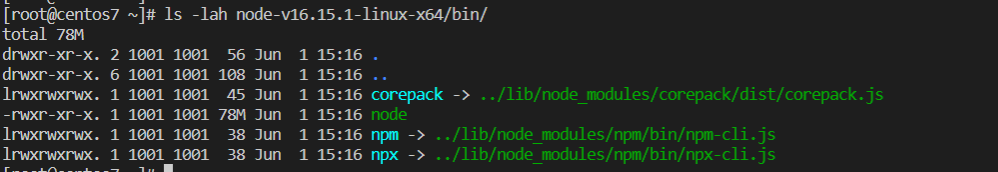
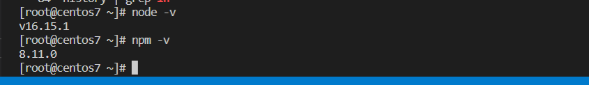
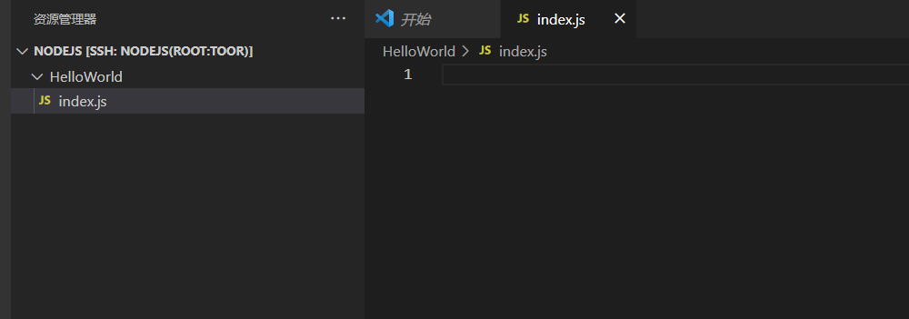
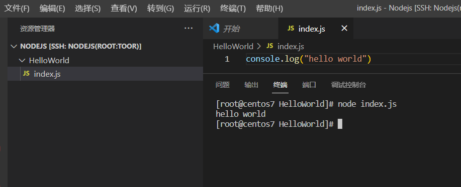

# 环境准备

**编译器**：Visual Studio Code

**操作系统发行版本**：Centos7.9

**npm版本**：8.11.0

**node版本**:v16.15.1

**执行用户**：Root用户

# 安装开发环境

**Visual Studio Code 安装**

https://blog.csdn.net/weixin_46245846/article/details/113793024

**nodejs安装**——这里采用二进制可执行文件直接进行安装

这里基于Centos 7进行开发安装

```
wget https://nodejs.org/dist/v16.15.1/node-v16.15.1-linux-x64.tar.xz
```

下载成功之后进行解压

```
tar xvf node-v16.15.1-linux-x64.tar.xz
```

解压成功之后，查看是否有对应的软件

```
ls -lah node-v16.15.1-linux-x64/bin/
```



设置软连接

```
ln -s node-v16.15.1-linux-x64/bin/node /usr/bin/node
ln -s node-v16.15.1-linux-x64/bin/npm /usr/bin/npm
```

设置软连接之后，输入`node -v`与`npm -v`查看是否安装完毕。



# 执行第一个nodejs程序

**打开Visual Studio Code**

创建一个文件夹Helloword，在文件夹中创建一个index.js文件



在文件中输入以下内容

```
console.log("hello world")
```

执行程序，查看结果

```
node index.js
```


