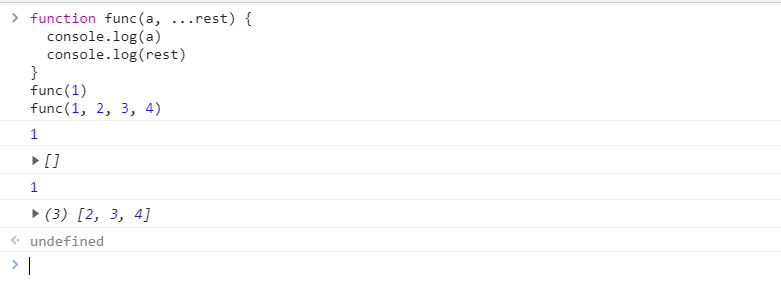
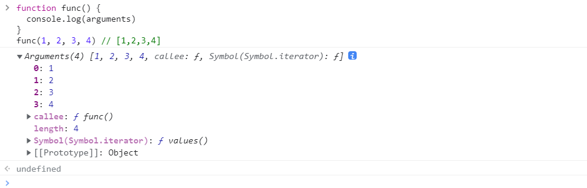

# 函数默认值

增加了带参数的默认值函数。

```javascript
functin add(a,b = 20){
	return a+b;
}
console.log(add(30))
// output 50
```

默认的参数也可以是一个函数

```javascript
function add(a,b = getVal(5)){
	return a+b;
}
function getVal(val){
	return val + 5;
}
console.log(add(5))
// output 15
```


# 剩余参数

解决了arguements问题，假设不知道输入的参数，那么可以通过剩余参数的写法将实参变为剩余参数列表。使用方式就是作为形参，只是需要在前面加上三个点：...

```javascript
function func(a, ...rest) {
  console.log(a)
  console.log(rest)
}
func(1)
func(1, 2, 3, 4)
```

结果显示



既然是剩余参数，所以在剩余参数后面就不要添加新的参数，不然会出错。

```javascript
function func(a, ...rest, b) {
 
}
```

同时一个函数也可以没有任何其他参数，只有一个剩余参数。而这种做法就和arguments一致了。

**剩余参数**

```javascript
function func(...rest) {
  console.log(rest)
}
func(1, 2, 3, 4) // [1,2,3,4]
```

**Arguments**

```
function func() {
  console.log(arguments)
}
func(1, 2, 3, 4) // [1,2,3,4]
```

显示结果



**arguments和剩余参数的区别**

- arguments是一个伪数组（Array-like）
- 剩余参数是一个真正数组（Array），具有Array.prototype上的所有方法
- arguments上有callee，callee上有caller

 

# 函数扩展运算符

扩展运算符是通过`...`来实现的，剩余运算符，是将多个独立的参数合并到同一个数组中。扩展运算符则是将一个数组进行分割，并将各个项作为分离的参数传给函数。

例如查找一个数组中的最大值。

```javascript
const arr = [1,2,3,4,5,6,7,8,11,1,3]
console.log(Math.max(...arr))
```


# 箭头函数

在es6中可以更加方便地编写函数，直接通过箭头函数即可完成。使得代码更加美观。

```javascript
let add = (a,b) =>{
	return a+b;
}
```

等价于

```javascript
let add = function(a,b){
	return a+b;
}
```

等价于

```javascript
function add(a,b){
	return a+b;
}
```

如果只有一个参数，那么可以更加简便。如下写法：

```javascript
let add = val =>{
	return val+5;
}
```

如果函数中只有一个表达式，那么则可以更加简便，直接使用大括号即可。

```javascript
let add = val => val+5;
```

如果没有参数的话，那么小括号必须保留。

```javascript
let add = ()=> 15;
```
